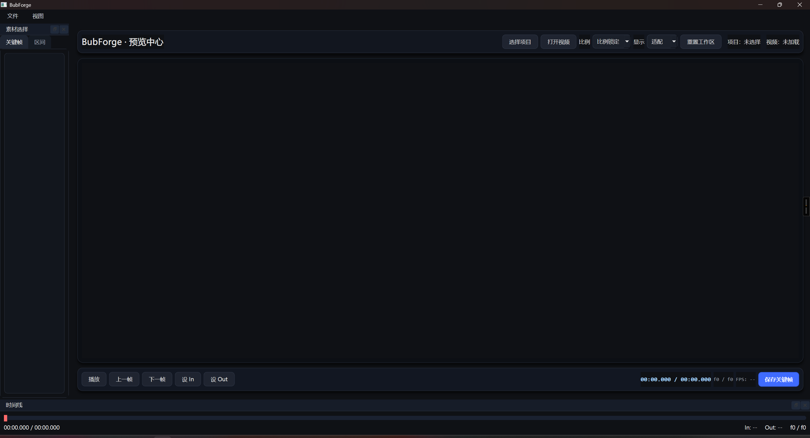

# BubForge 🫧🔨

**像剪辑软件一样快速预览视频、挑选关键帧与区间帧，并增量导出数据集骨架。**

> 🚀 **目标**: 提供高效的视频数据清洗工作流，无缝对接 YOLO/COCO 数据集格式。

---

## 📸 界面预览


<br>

<!-- 在这里插入时间线或关键帧选择的特写 -->

---

## ✨ 核心特性

- **非线性编辑体验**: 类似 Premiere/Final Cut 的时间线交互，毫秒级逐帧定位。
- **高效筛选**: 支持单帧挑选（Keyframe）和片段范围（Range）批量抽帧。
- **增量工作流**: 智能去重，自动跳过已存在的帧，避免重复计算。
- **元数据追踪**: 所有操作记录在 `metadata/frames.csv`，数据来源可追溯。
- **多格式导出**: 内置 Raw、Ultralytics (YOLO)、COCO 等多种数据集骨架导出预设。
- **灵活布局**: 基于 PySide6 的 Dock 系统，支持自定义窗口布局与状态记忆。

---

## 🛠️ 快速开始

### 1. 环境要求
- Windows 10 / 11
- Python 3.10+
- **FFmpeg & FFprobe**: 需配置在系统环境变量 PATH 中。

### 2. 安装
```bash
# 克隆仓库
git clone https://github.com/yourusername/BubForge.git
cd BubForge

# 安装依赖
pip install -r requirements.txt
```

### 3. 运行
```bash
python main.py
```

---

## 🎮 快捷键指南

BubForge 采用了符合剪辑直觉的快捷键映射（可在 `gui/shortcuts.py` 查看完整定义）：

| 基础按键 | 功能 | 说明 |
| :--- | :--- | :--- |
| **Space** | 播放 / 暂停 | |
| **A / D** | 上一帧 / 下一帧 | 精确逐帧移动 |
| **J / L** | 快退 / 快进 | 连续回放/倒放 |
| **S** | 保存关键帧 | 立即保存当前画面，并自动跳至下一帧 |

| 区间操作 | 功能 | 说明 |
| :--- | :--- | :--- |
| **I / O** | 设置 入点 / 出点 | 标记当前区间的起始(In)与结束(Out) |
| **Enter** | 添加区间 | 将当前 I/O 范围加入待导出列表 |
| **E** | 执行抽帧 | 对选定的区间进行批量抽帧（默认 5fps） |
| **Esc** | 取消 | 清除当前的 I/O 标记 |

| 导航微调 | 功能 |
| :--- | :--- |
| **← / →** | 1 帧步进 |
| **Shift + ← / →** | 10 帧步进 |
| **Ctrl + ← / →** | 约 1 秒步进 |

---

## 📂 落盘数据结构

你的工作成果将按以下结构整齐保存：

```text
BubForgeProject/
├── project.yaml            # 项目配置
├── frames/                 # 抽取的图像文件
│   └── video_name__hash/
│       ├── keyframes/      # 单帧挑出的图
│       └── ranges/         # 区间抽出的图
├── metadata/
│   └── frames.csv          # 核心元数据索引（包含 timestamp, path, kind 等）
└── logs/                   # 运行日志
```

## 📦 导出格式支持

在右侧导出面板，你可以选择以下几种“骨架”格式（Skeleton）：

1. **Raw Frames**: 仅导出图片和元数据 CSV。
2. **Ultralytics (YOLO)**: 生成 `images/train`, `images/val` 目录结构和 `data.yaml`，方便直接开始标注。
3. **COCO**: 生成标准 COCO 目录结构和 `annotations.json` 模板。

---

## 📖 文档索引

- [用户手册 (User Guide)](docs/user_guide.md)
- [开发指南 (Dev Guide)](docs/dev_guide.md)
- [常见问题 (Troubleshooting)](docs/troubleshooting.md)
- [第三方声明](THIRD_PARTY_NOTICES.md)
